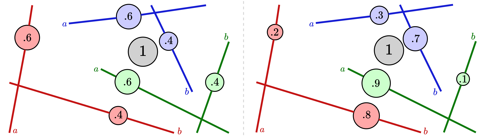

# Distance-Based Tree-Sliced Wasserstein Distance
<div align="center">
    
</div>

[](https://iclr.cc/Conferences/2025)
[](https://openreview.net/forum?id=OiQttMHwce)

Official implementation of the paper "Distance-Based Tree-Sliced Wasserstein Distance" (ICLR 2025).


## Overview

This repository contains the implementation of Distance-Based Tree-Sliced Wasserstein Distance (Db-TSW), a novel approach for computing optimal transport distances between two measures. Our method extends the traditional Tree-Sliced Wasserstein Distance by incorporating a distance-based splitting map, leading to the metric which is Euclidean-invariant and contains richer positional information. 

The proposed method is mainly used to improve the performance of generative models. We have demonstrated the effectiveness of DB-TSWD in a diffusion generative model DD-GAN and achieved a significant improvement in terms of FID score compared to the baseline. We have also shown that DB-TSWD can be used to improve the performance of other basic optimal transport-based tasks including color transfer and gradient flow. 

## Installation

To use Db-TSW, you need to install this repository by running the following command:
```
git clone https://github.com/Fsoft-AIC/DbTSW
cd DbTSW
pip install .
```

## Quick Start

This is a quick example for using Db-TSW:
```python
from db_tsw.db_tsw import DbTSW
from db_tsw.utils import generate_trees_frames

TW_obj = torch.compile(DbTSW())

N = 5
M = 5
dn = dm = 3
ntrees = 7
nlines = 2
    
theta, intercept = generate_trees_frames(ntrees, nlines, dn, gen_mode="gaussian_orthogonal")
X = torch.rand(N, dn).to("cuda")
Y = torch.rand(M, dm).to("cuda")
TW_obj(X, Y, theta, intercept)
```

## Main Components

The `db_tsw.db_tsw` module contains the main implementation of the Db-TSW algorithm.
- `TWConcurrentLines` computes the Tree Wasserstein (TW) distance between two distributions. It supports both uniform and distance-based mass division methods. Key parameters include:
    - `p`: Level of the norm.
    - `delta`: Negative inverse of the softmax temperature for distance-based mass division.
    - `mass_division`: Method to divide the mass, either 'uniform' or 'distance_based'.
    - `device`: Device to run the code on, e.g., "cuda".
- `DbTSW` extends `TWConcurrentLines` with the `mass_division` parameter set to 'distance_based', focusing on distance-based mass division for TW distance computation.

**Important notes**: we recommend using `torch.compile` for both classes to improve performance.
```python
from db_tsw.db_tsw import DbTSW
TW_obj = torch.compile(DbTSW())
```

The `db_tsw.utils` module contains utility functions for generating trees and frames.
- `generate_trees_frames` generates random trees and frames for the Db-TSW algorithm. It supports two modes by the `gen_mode` parameter:
    - `gaussian_raw`: Generates random lines with Gaussian distribution and normalizes them.
    - `gaussian_orthogonal`: Generates orthogonal lines using SVD, ensuring the number of lines does not exceed the dimensionality.

## Reproducing Experiments

The `experiments` folder contains the code for reproducing the results in the paper. It consists of three main folders corresponding to the three main tasks: `gradient_flow`, `color_transfer`, and `generative_models`. For further details, please refer to the README files in each folder.

## Citation

If you find this code useful in your research, please cite our paper:

```bibtex
@inproceedings{tran2025distance,
    title={Distance-Based Tree-Sliced {W}asserstein Distance},
    author={Tran, Hoang V. and Nguyen-Nhat, Minh-Khoi and Pham, Huyen Trang and Chu, Thanh and Le, Tam and Nguyen, Tan Minh},
    booktitle={International Conference on Learning Representations},
    year={2025},
    url={https://openreview.net/forum?id=OiQttMHwce}
}
```


## Contact

For questions about the code or paper, please open an issue in this repository or contact the authors directly.
